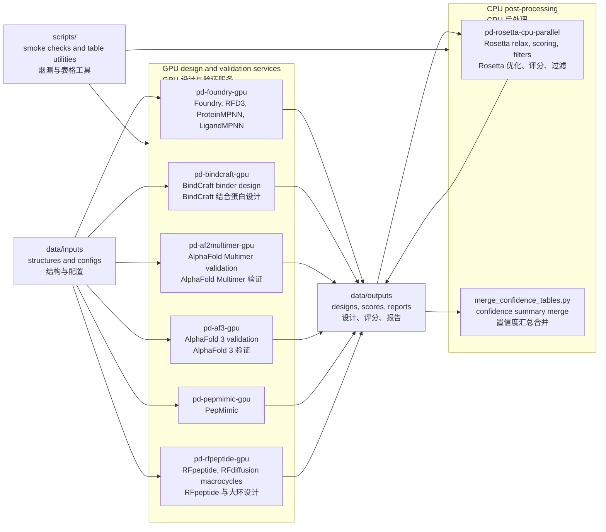
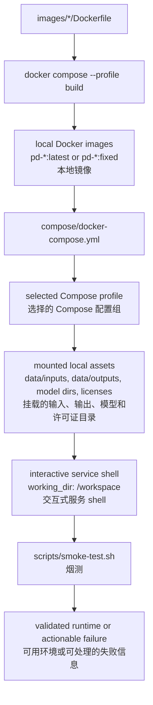

# Protein Design Workbench

Docker-based local workbench for protein design workflows on this machine.

本仓库是这台机器上的蛋白设计本地工作台，主要用 Docker Compose 管理
Foundry/RFD3、BindCraft、AlphaFold Multimer、AlphaFold 3、Rosetta、PepMimic
和 RFpeptide 等运行环境。

Current version / 当前版本: `v0.2.0`

Release notes / 版本说明: [CHANGELOG.md](CHANGELOG.md)

This repository tracks only lightweight engineering assets. Large local assets
stay outside Git under `data/` and `releases/`.

本仓库只跟踪轻量工程文件。模型权重、数据库、设计输出和镜像归档等大文件保留在
`data/` 和 `releases/` 下，不进入 Git。

## Repository Policy / 仓库策略

Tracked in Git / Git 跟踪内容:

- `compose/`: Docker Compose service definitions / Docker Compose 服务定义
- `images/*/Dockerfile`: Docker build recipes / Docker 镜像构建文件
- `scripts/`: utility scripts / 工具脚本
- `docs/`, `README.md`, `.gitignore`, and other small configuration files /
  文档、README、忽略规则和其他小型配置文件

Not tracked in Git / Git 不跟踪内容:

- model weights and checkpoints / 模型权重和检查点
- Rosetta source/database assets / Rosetta 源码和数据库资源
- AlphaFold, BindCraft, Foundry, PepMimic, and RFdiffusion parameters /
  AlphaFold、BindCraft、Foundry、PepMimic 和 RFdiffusion 参数
- generated outputs and score tables / 生成结果和评分表
- Docker image archives and release bundles / Docker 镜像归档和发布包
- local crash logs, PDFs, shell history, and editor caches /
  本地崩溃日志、PDF、shell 历史和编辑器缓存

## Local Asset Layout / 本地资产目录

| Path / 路径 | Purpose / 用途 |
| --- | --- |
| `data/inputs/` | input structures and workflow configuration / 输入结构和流程配置 |
| `data/outputs/` | generated workflow outputs / 生成的设计结果 |
| `data/alphafold_db/` | AlphaFold 2 Multimer parameter/database assets / AlphaFold 2 Multimer 参数和数据库 |
| `data/alphafold3/models/` | AlphaFold 3 model file, including `af3.bin.zst` / AlphaFold 3 权重文件 |
| `data/alphafold3/public_databases/` | AlphaFold 3 sequence/template databases / AlphaFold 3 序列和模板数据库 |
| `data/alphafold3/jax_cache/` | AlphaFold 3 JAX compilation cache / AlphaFold 3 JAX 编译缓存 |
| `data/bindcraft_models/` | BindCraft model parameters / BindCraft 模型参数 |
| `data/foundry_checkpoints/` | Foundry/ProteinMPNN/LigandMPNN checkpoints / Foundry、ProteinMPNN、LigandMPNN 检查点 |
| `data/pepmimic_checkpoints/` | PepMimic checkpoints / PepMimic 检查点 |
| `data/rfpeptide_models/` | RFpeptide/RFdiffusion checkpoints / RFpeptide、RFdiffusion 检查点 |
| `data/rosetta_db` | symlink to the local Rosetta database / 指向本地 Rosetta 数据库的软链接 |
| `releases/` | exported local image bundles / 导出的本地镜像包 |

## Workflow Overview / 工作流概览



See [docs/service-flows.md](docs/service-flows.md) for per-service build,
mount, and output diagrams.

每个服务的构建输入、运行时挂载和输出位置见
[docs/service-flows.md](docs/service-flows.md)。

For the local AlphaFold 3 image, model file layout, and run commands, see
[docs/af3-local-workflow.md](docs/af3-local-workflow.md).

本地 AlphaFold 3 镜像、权重文件位置和运行命令见
[docs/af3-local-workflow.md](docs/af3-local-workflow.md)。

Use `./scripts/fetch-af3-databases.sh start` to prepare AF3 databases with the
official fetch script and project paths.

可用 `./scripts/fetch-af3-databases.sh start` 按项目路径调用官方脚本准备 AF3
数据库。

For a beginner-friendly Chinese guide covering Linux basics, shell scripts,
command parameters, and peptide design workflows, see
[docs/undergrad-guide-zh.md](docs/undergrad-guide-zh.md).

面向药学本科生的中文入门手册见
[docs/undergrad-guide-zh.md](docs/undergrad-guide-zh.md)，其中包含 Linux 基础、
`.sh` 脚本读法、命令参数和多肽生成/改造流程说明。

Runnable task-level examples are available under [examples/](examples/).

可运行的任务级示例位于 [examples/](examples/)。

## Docker Flow / Docker 流程



## Compose Profiles / Compose 配置组

| Profile / 配置组 | Service / 服务 | Purpose / 用途 | GPU |
| --- | --- | --- | --- |
| `foundry`, `design`, `rfd3`, `mpnn` | `pd-foundry-gpu` | Foundry/RFD3/MPNN workflows / Foundry、RFD3、MPNN 流程 | yes / 是 |
| `bindcraft` | `pd-bindcraft-gpu` | BindCraft binder design / BindCraft 结合蛋白设计 | yes / 是 |
| `af2`, `multimer` | `pd-af2multimer-gpu` | AlphaFold Multimer validation / AlphaFold Multimer 验证 | yes / 是 |
| `af3`, `validate` | `pd-af3-gpu` | AlphaFold 3 validation / AlphaFold 3 验证 | yes / 是 |
| `rosetta`, `post`, `rosetta-parallel` | `pd-rosetta-cpu-parallel` | Rosetta relax/scoring/post-processing / Rosetta 优化、评分、后处理 | no / 否 |
| `pepmimic` | `pd-pepmimic-gpu` | PepMimic workflows / PepMimic 流程 | yes / 是 |
| `rfpeptide`, `macrocycle` | `pd-rfpeptide-gpu` | RFpeptide/RFdiffusion macrocycle workflows / RFpeptide 与 RFdiffusion 大环流程 | yes / 是 |

## Runtime Mounts / 运行时挂载

All Compose services mount `data/inputs`, `data/outputs`, and `scripts` into the
container. The tracked `examples` directory is mounted read-only at
`/workspace/examples`.

所有 Compose 服务都会把 `data/inputs`、`data/outputs` 和 `scripts` 挂载到容器中。
已跟踪的 `examples` 目录会以只读方式挂载到 `/workspace/examples`。

Service-specific mounts / 服务专属挂载:

| Service / 服务 | Mounted assets / 挂载资源 |
| --- | --- |
| `pd-foundry-gpu` | `data/foundry_checkpoints` |
| `pd-bindcraft-gpu` | `data/bindcraft_models`, `data/licenses` |
| `pd-af2multimer-gpu` | `data/alphafold_db` |
| `pd-af3-gpu` | `data/alphafold3/models`, `data/alphafold3/public_databases`, `data/alphafold3/jax_cache` |
| `pd-rosetta-cpu-parallel` | `data/rosetta_db`, `data/licenses` |
| `pd-pepmimic-gpu` | `data/pepmimic_checkpoints`, `data/licenses` |
| `pd-rfpeptide-gpu` | `data/rfpeptide_models` |

## Common Commands / 常用命令

Validate Compose configuration / 验证 Compose 配置:

```bash
docker compose -f compose/docker-compose.yml config --quiet
```

Check host GPU / 检查宿主机 GPU:

```bash
nvidia-smi
```

Build or refresh a service image / 构建或刷新服务镜像:

```bash
docker compose -f compose/docker-compose.yml --profile foundry build pd-foundry-gpu
docker compose -f compose/docker-compose.yml --profile af2 build pd-af2multimer-gpu
docker build -t pd-af3-gpu:v3.0.2 -f data/src/alphafold3/docker/Dockerfile data/src/alphafold3
docker compose -f compose/docker-compose.yml --profile rosetta build pd-rosetta-cpu-parallel
docker compose -f compose/docker-compose.yml --profile pepmimic build pd-pepmimic-gpu
docker compose -f compose/docker-compose.yml --profile rfpeptide build pd-rfpeptide-gpu
```

Open a service shell / 打开服务 shell:

```bash
docker compose -f compose/docker-compose.yml --profile foundry run --rm pd-foundry-gpu
docker compose -f compose/docker-compose.yml --profile bindcraft run --rm pd-bindcraft-gpu
docker compose -f compose/docker-compose.yml --profile af2 run --rm pd-af2multimer-gpu
docker compose -f compose/docker-compose.yml --profile af3 run --rm pd-af3-gpu
docker compose -f compose/docker-compose.yml --profile rosetta run --rm pd-rosetta-cpu-parallel
docker compose -f compose/docker-compose.yml --profile pepmimic run --rm pd-pepmimic-gpu
docker compose -f compose/docker-compose.yml --profile rfpeptide run --rm pd-rfpeptide-gpu
```

Run smoke checks / 运行烟测:

```bash
./scripts/smoke-test.sh all
```

Run workflow examples / 运行工作流示例:

```bash
./examples/foundry/run-mpnn-pdl1.sh
./examples/af2multimer/run-check-or-full.sh
./examples/af3/run-check-or-full.sh
./examples/rosetta/run-relax-pdl1.sh
./examples/confidence/run-merge-srcr.sh
```

Merge confidence JSON files into ranked CSV/XLSX tables /
合并置信度 JSON 并输出排序后的 CSV/XLSX 表:

```bash
python3 scripts/merge_confidence_tables.py \
  --root-dir data/outputs/AAAWZY/srcr-rf3
```

Write CSV only to an explicit path / 只写 CSV 到指定路径:

```bash
python3 scripts/merge_confidence_tables.py \
  --root-dir data/outputs/AAAWZY/srcr-rf3 \
  --out-csv /tmp/srcr-rf3-confidence.csv \
  --no-xlsx
```

## Operational Notes / 运维注意事项

- Use Compose for Rosetta so that `data/rosetta_db` is mounted at
  `/opt/rosetta_db`. / Rosetta 请通过 Compose 运行，确保 `data/rosetta_db`
  挂载到 `/opt/rosetta_db`。
- Use `pd-rfpeptide-gpu:fixed` for RFpeptide. The local `latest` tag is not the
  known-good runtime. / RFpeptide 使用 `pd-rfpeptide-gpu:fixed`，本地 `latest`
  不是已确认可用的运行环境。
- AlphaFold 3 uses the independent `pd-af3-gpu:v3.0.2` image. It does not use
  the AlphaFold 2 Multimer image or `data/alphafold_db`. / AlphaFold 3 使用独立
  的 `pd-af3-gpu:v3.0.2` 镜像，不使用 AlphaFold 2 Multimer 镜像或
  `data/alphafold_db`。
- The AlphaFold 3 model file lives at `data/alphafold3/models/af3.bin.zst` and
  is mounted into the container at `/root/models/af3.bin.zst`. / AlphaFold 3
  权重文件位于 `data/alphafold3/models/af3.bin.zst`，容器内路径为
  `/root/models/af3.bin.zst`。
- Do not commit local model files or workflow outputs. Check `git status`
  before every commit. / 不要提交本地模型文件或工作流输出；每次提交前检查
  `git status`。
- Docker build cache is large on this machine. Do not prune it until critical
  images are exported or confirmed rebuildable. / 这台机器上的 Docker 构建缓存较大；
  关键镜像导出或确认可重建前不要清理。
