# Protein Design Workbench

<p align="center">
  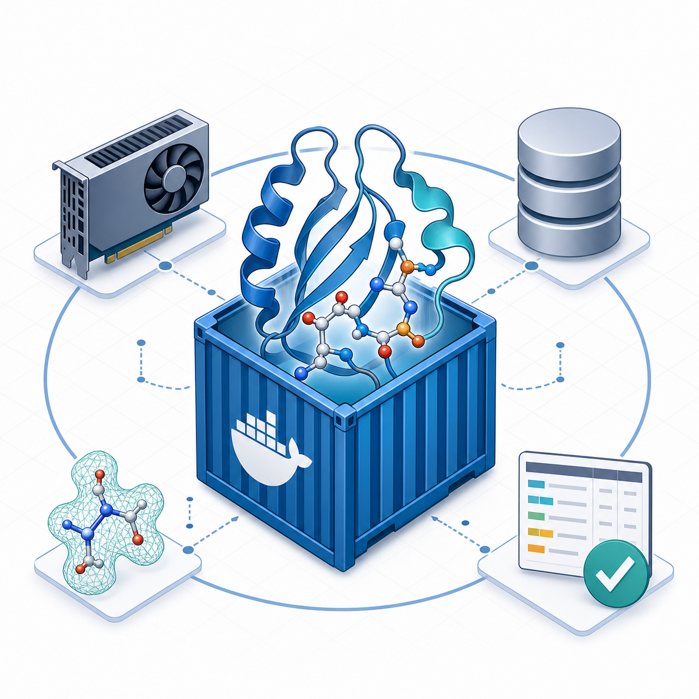
</p>

Docker-based local workbench for protein design workflows on this machine.

本仓库是这台机器上的蛋白设计本地工作台，主要用 Docker Compose 管理
Foundry/RFD3、BindCraft、AlphaFold Multimer、AlphaFold 3、Rosetta、PepMimic
和 RFpeptide 等运行环境。

Current version / 当前版本: `v0.3.0`

Release notes / 版本说明: [CHANGELOG.md](CHANGELOG.md)

This repository tracks only lightweight engineering assets. Large local assets
stay outside Git under `data/` and `releases/`.

本仓库只跟踪轻量工程文件。模型权重、数据库、设计输出和镜像归档等大文件保留在
`data/` 和 `releases/` 下，不进入 Git。

## Repository Policy / 仓库策略

Tracked in Git / Git 跟踪内容:

- `compose/`: Docker Compose service definitions / Docker Compose 服务定义
- `images/*/Dockerfile`: Docker build recipes / Docker 镜像构建文件
- `scripts/`: utility scripts / 工具脚本
- `docs/`, `README.md`, `.gitignore`, and other small configuration files /
  文档、README、忽略规则和其他小型配置文件

Not tracked in Git / Git 不跟踪内容:

- model weights and checkpoints / 模型权重和检查点
- Rosetta source/database assets / Rosetta 源码和数据库资源
- AlphaFold, BindCraft, Foundry, PepMimic, and RFdiffusion parameters /
  AlphaFold、BindCraft、Foundry、PepMimic 和 RFdiffusion 参数
- generated outputs and score tables / 生成结果和评分表
- Docker image archives and release bundles / Docker 镜像归档和发布包
- local crash logs, PDFs, shell history, and editor caches /
  本地崩溃日志、PDF、shell 历史和编辑器缓存

## Local Asset Layout / 本地资产目录

| Path / 路径 | Purpose / 用途 |
| --- | --- |
| `data/inputs/` | input structures and workflow configuration / 输入结构和流程配置 |
| `data/outputs/` | generated workflow outputs / 生成的设计结果 |
| `data/alphafold_db/` | AlphaFold 2 Multimer parameter/database assets / AlphaFold 2 Multimer 参数和数据库 |
| `data/alphafold3/models/` | AlphaFold 3 model file, including `af3.bin.zst` / AlphaFold 3 权重文件 |
| `data/alphafold3/public_databases/` | AlphaFold 3 sequence/template databases / AlphaFold 3 序列和模板数据库 |
| `data/alphafold3/jax_cache/` | AlphaFold 3 JAX compilation cache / AlphaFold 3 JAX 编译缓存 |
| `data/bindcraft_models/` | BindCraft model parameters / BindCraft 模型参数 |
| `data/foundry_checkpoints/` | Foundry/ProteinMPNN/LigandMPNN checkpoints / Foundry、ProteinMPNN、LigandMPNN 检查点 |
| `data/pepmimic_checkpoints/` | PepMimic checkpoints / PepMimic 检查点 |
| `data/rfpeptide_models/` | RFpeptide/RFdiffusion checkpoints / RFpeptide、RFdiffusion 检查点 |
| `data/rosetta_db` | symlink to the local Rosetta database / 指向本地 Rosetta 数据库的软链接 |
| `releases/` | exported local image bundles / 导出的本地镜像包 |

## Workflow Overview / 工作流概览

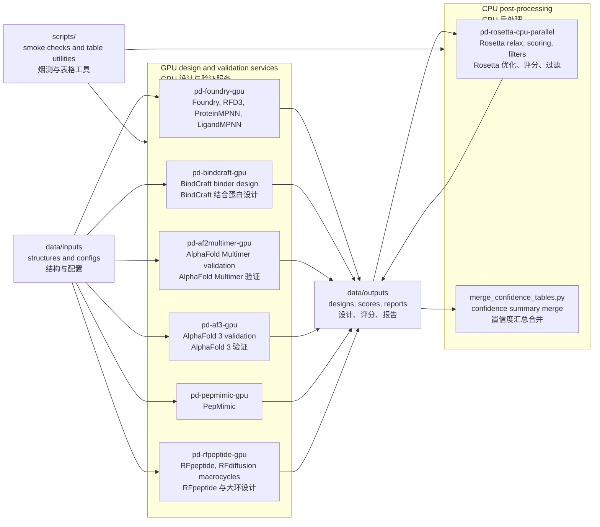

The graphical abstract below was generated with `imagegen` in a
Nature Methods-style academic visual language. It integrates the repository
workflow overview, method-level information flow, and per-image workflow
figures into one reader-facing map. Exact tool names, paths, and information
transfer rules are documented in the captions, tables, and remaining
operational Mermaid diagrams that follow.

下图使用 `imagegen` 生成，采用接近 Nature Methods 图形摘要的学术视觉风格。它把
项目总览、方法层信息流和各镜像流程整合成一张便于阅读的流程图。准确的工具名称、
路径和信息传递关系以随后可维护的图注、表格和运维 Mermaid 图为准。

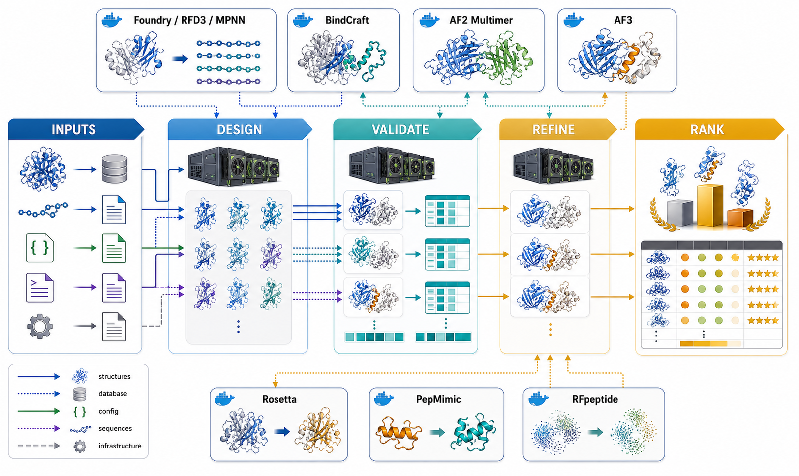

Figure guide / 图示说明:

- `INPUTS`: structures, sequences, AF3 JSON, FASTA, settings, and database
  evidence. / 输入结构、序列、AF3 JSON、FASTA、配置和数据库证据。
- `DESIGN`: generation and redesign modules such as Foundry/RFD3/MPNN,
  BindCraft, PepMimic, and RFpeptide. / 生成与改造模块，包括
  Foundry/RFD3/MPNN、BindCraft、PepMimic 和 RFpeptide。
- `VALIDATE`: AF2 Multimer and AF3 complex inference with confidence metrics.
  / AF2 Multimer 与 AF3 复合物推断和置信度指标。
- `REFINE`: Rosetta physical relaxation and scoring. / Rosetta 物理优化与打分。
- `RANK`: ranked candidate structures, sequences, confidence tables, and
  decision-ready portfolios. / 排序后的候选结构、序列、置信度表和可决策候选集合。

## Method-Level Information Flow / 方法学信息流

The workbench is organized as a modular computational pipeline. Each Docker
image preserves a distinct methodological role, while `data/inputs` and
`data/outputs` act as explicit boundaries for exchanging structures, sequences,
configuration files, confidence metrics, and ranked candidate tables.

本项目按模块化计算流程组织。每个 Docker 镜像承担相对独立的方法学角色；
`data/inputs` 和 `data/outputs` 是结构、序列、配置、置信度指标和候选排序表之间
传递信息的边界。

### Overall Project Flow / 整体项目流程

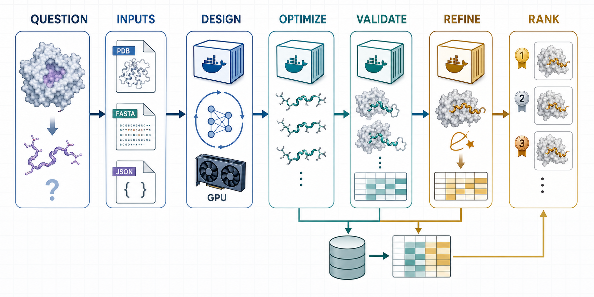

The project logic is simple: use generative tools such as RFpeptide/RFdiffusion,
RFD3/Foundry, BindCraft, and PepMimic to propose peptide or binder candidates;
use ProteinMPNN/LigandMPNN to make sequences compatible with the proposed
backbones or interfaces; use AF2 Multimer or AF3 to test whether the designed
molecules form plausible complexes; use Rosetta to relax and score the physical
model; then merge confidence and energy evidence into ranked candidates for
manual inspection or experimental follow-up.

项目逻辑可以概括为一条主线：先用 RFpeptide/RFdiffusion、RFD3/Foundry、
BindCraft、PepMimic 等生成式工具提出多肽或结合体候选；再用
ProteinMPNN/LigandMPNN 让序列适配骨架或界面；随后用 AF2 Multimer 或 AF3
验证这些候选是否能形成合理复合物；再用 Rosetta 做物理层面的 relax 和打分；
最后把置信度、能量和界面证据汇总成候选排序，用于人工检查或后续实验。

### Tool Methodology at a Glance / 工具方法定位速览

| Tool / 工具 | Methodological focus / 方法论侧重 | Used for / 在流程中的用途 |
| --- | --- | --- |
| RFD3/Foundry | Geometric backbone and complex hypotheses / 几何骨架和复合物假设 | Propose where a peptide or binder could sit before sequence design / 在序列设计前提出多肽或结合体可能的位置和形状 |
| ProteinMPNN/LigandMPNN | Sequence compatibility with a fixed backbone or interface / 给定骨架或界面的序列适配 | Convert designed backbones into amino acid sequences / 把设计骨架转化为氨基酸序列 |
| BindCraft | Iterative interface-centered binder design / 面向界面的迭代式 binder 设计 | Generate candidates around receptor hotspots / 围绕受体热点生成结合体候选 |
| RFpeptide/RFdiffusion | Diffusion-based constrained peptide or macrocycle generation / 基于扩散模型的约束多肽或大环生成 | Explore diverse peptide backbones under topology constraints / 在拓扑约束下探索多样化多肽骨架 |
| PepMimic | Motif and epitope mimicry / 模体和表位模拟 | Generate peptides that preserve key epitope geometry / 生成保留关键表位几何的模拟肽 |
| AF2 Multimer | Learned complex prediction from FASTA chains / 基于 FASTA 链的复合物预测 | Triage whether designed chains form plausible interfaces / 初筛设计链是否形成合理界面 |
| AF3 | JSON-based broader molecular structure validation / 基于 JSON 的更通用分子结构验证 | Cross-check or extend complex validation beyond the AF2 Multimer path / 交叉验证或扩展 AF2 Multimer 之外的结构验证 |
| Rosetta | Physics-oriented relaxation, packing, and energy scoring / 物理取向的 relax、堆积和能量评分 | Remove candidates that fail local geometry or energy checks / 淘汰局部几何或能量不可靠的候选 |

### Per-Image Workflow Figures / 各镜像流程图

#### `pd-foundry-gpu`

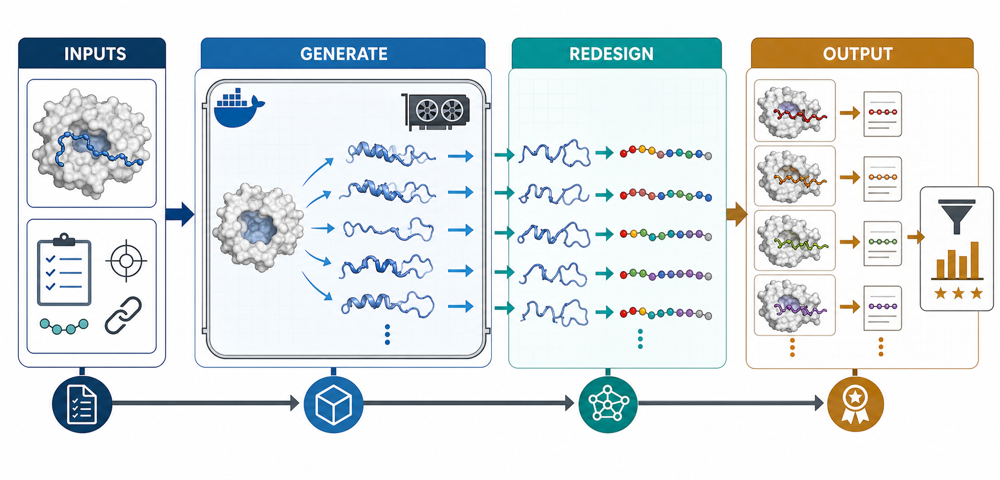

This flow connects RFD3/Foundry-style backbone generation with
ProteinMPNN/LigandMPNN sequence design. RFD3/Foundry focuses on geometric
hypotheses: where the chain should be, how it should contact the target, and
which motif or topology should be preserved. MPNN then asks a narrower question:
given that backbone or interface, which amino acid sequence is compatible with
it? The purpose is to turn a structural design idea into sequence-bearing
candidates that can be tested by AF2/AF3 and refined by Rosetta.

这条流程把 RFD3/Foundry 的骨架生成和 ProteinMPNN/LigandMPNN 的序列设计串起来。
RFD3/Foundry 侧重几何假设：链应该放在哪里、怎样接触靶点、保留哪些模体或拓扑；
MPNN 接着回答更具体的问题：在这个骨架或界面上，什么氨基酸序列更合适。这个流程的
目的，是把一个结构设计想法变成带有明确序列的候选分子，再交给 AF2/AF3 验证、
Rosetta 优化。

#### `pd-bindcraft-gpu`

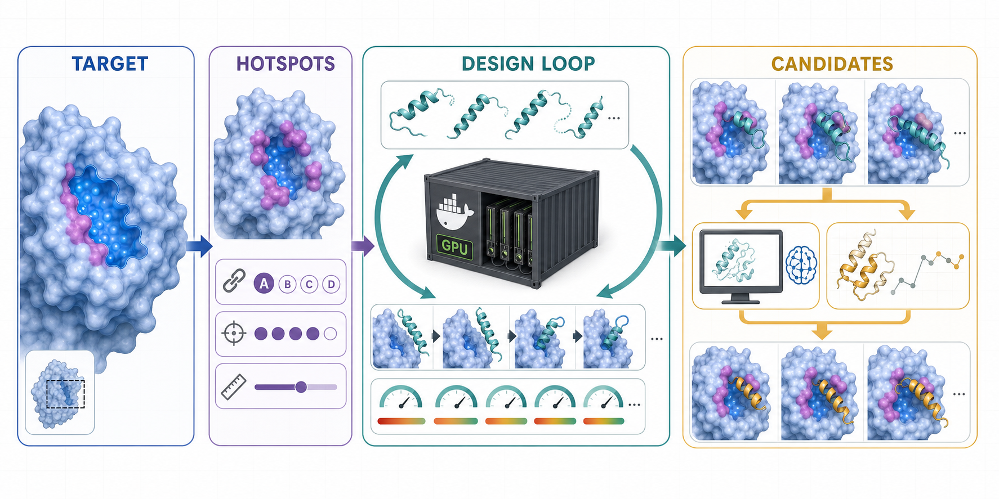

BindCraft is used when the main problem is interface design rather than a
free-form peptide library. It starts from a receptor surface and hotspot
residues, then searches for binder or peptide-binder structures that can make
the desired contacts. Its method focus is iterative interface optimization:
generate, evaluate the contact geometry, filter, and repeat. The resulting
binders are not final answers; they are hypotheses that should be checked by
AF2/AF3 for complex plausibility and by Rosetta for local packing and energy.

BindCraft 适合用于“围绕受体界面设计结合体”的问题，而不是无目标地生成多肽库。它从
受体表面和热点残基出发，搜索能够形成目标接触的 binder 或 peptide binder。方法论
重点是迭代式界面优化：生成、检查接触几何、过滤，再继续优化。输出的结合体不是最终
答案，而是需要继续交给 AF2/AF3 检查复合物合理性、再用 Rosetta 评估局部堆积和能量
的结构假设。

#### `pd-af2multimer-gpu`

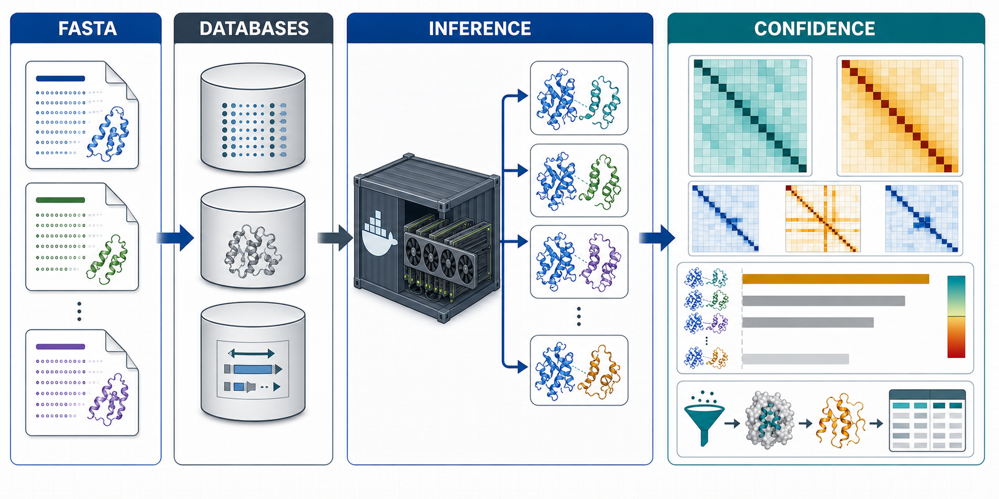

AF2 Multimer is the conservative validation branch for protein-peptide or
protein-binder complexes represented as FASTA chains. It uses sequence and
database evidence to infer whether chains can form a stable-looking complex,
then reports confidence signals such as pLDDT, pTM, ipTM, and PAE. In the
workflow it is mainly a triage tool: it helps reject candidates whose predicted
interface is unstable, ambiguous, or far from the intended binding mode before
spending more time on refinement.

AF2 Multimer 是较保守的复合物验证分支，适合把靶蛋白和多肽/结合体表示为多链 FASTA
后进行预测。它利用序列和数据库证据判断这些链是否可能形成稳定复合物，并输出 pLDDT、
pTM、ipTM、PAE 等置信度信号。在本流程中它主要承担“初筛”作用：尽早排除界面不稳定、
位置不确定或偏离预期结合模式的候选，避免后续浪费计算资源。

#### `pd-af3-gpu`

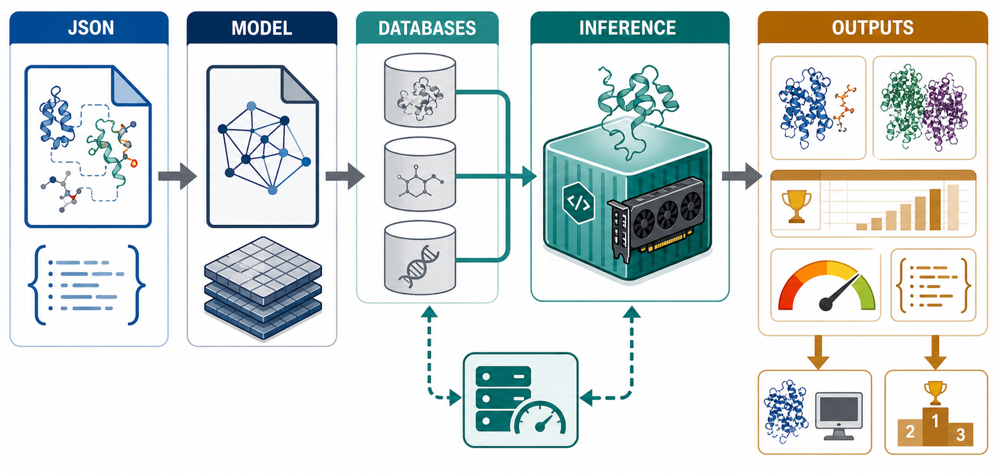

AF3 is the newer validation branch and is kept separate from AF2 Multimer in
this project. Instead of using the AF2 FASTA-only entry point, AF3 reads a JSON
description of the molecular system and uses its own model file and public
databases. Methodologically, AF3 is used when the validation target benefits
from its broader molecular representation or when results should be compared
against AF2 Multimer. Its outputs feed the same downstream decisions:
confidence-based ranking, optional Rosetta refinement, and manual structural
inspection.

AF3 是更新的验证分支，在本项目中与 AF2 Multimer 完全分开。它不是走 AF2 的 FASTA
入口，而是读取描述分子体系的 JSON，并使用独立的权重文件和公共数据库。方法论上，
当验证对象需要 AF3 更宽的分子表示能力，或者需要与 AF2 Multimer 结果交叉比较时，
就使用 AF3。它的输出仍然服务于同一个下游目标：按置信度排序、必要时做 Rosetta
优化，并进行人工结构检查。

#### `pd-rosetta-cpu-parallel`

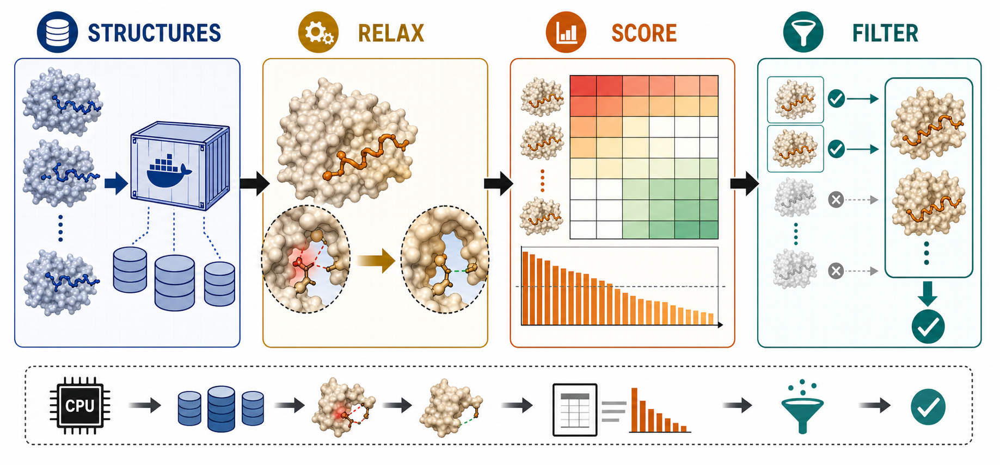

Rosetta is the physical refinement and scoring stage. AF2/AF3 tell us whether a
complex is plausible under a learned model; Rosetta asks a different question:
after local relaxation, does the structure still have reasonable packing,
stereochemistry, interface energy, and clashes? This makes Rosetta a
post-validation filter rather than a generator. It is used to remove candidates
that look good by confidence metrics but fail basic physical or energetic
checks.

Rosetta 是物理优化和打分阶段。AF2/AF3 主要回答“模型认为这个复合物是否可信”，
Rosetta 则换一个角度问：经过局部 relax 后，结构的堆积、立体化学、界面能量和空间
冲突是否仍然合理。因此 Rosetta 不是生成器，而是验证之后的物理筛选器，用来淘汰那些
置信度看起来不错但物理或能量层面不可靠的候选。

#### `pd-pepmimic-gpu`

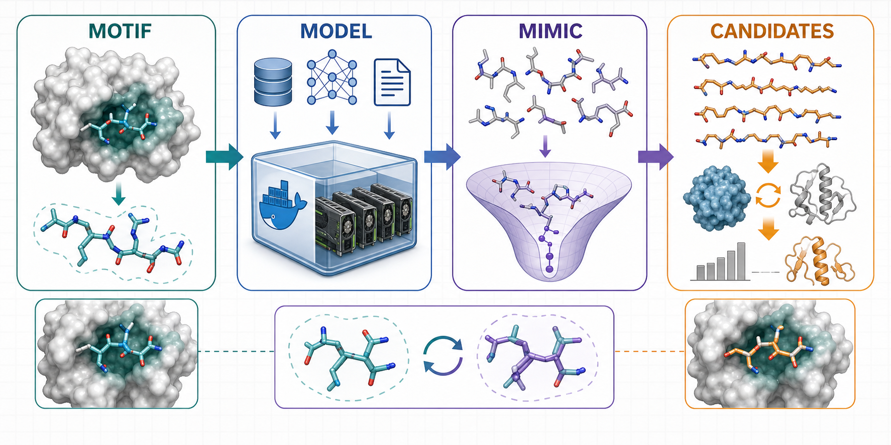

PepMimic is used when the design goal is not simply “bind this target”, but
“mimic this epitope or structural motif with a peptide-like molecule”. Its
method focus is motif preservation: retain the key geometry or interaction
pattern while proposing mimetic peptide candidates. The workflow therefore uses
PepMimic upstream of AF2/AF3 and Rosetta: first generate motif-like candidates,
then test whether they fold or bind plausibly, and finally refine or rank them.

PepMimic 适合“模拟某个表位或结构模体”的任务，而不只是泛泛地寻找能结合靶点的多肽。
它的方法论重点是模体保持：尽量保留关键几何关系或相互作用模式，同时提出模拟肽候选。
因此它位于 AF2/AF3 和 Rosetta 的上游：先生成类似模体的候选，再验证它们是否能合理
折叠或结合，最后再优化和排序。

#### `pd-rfpeptide-gpu`

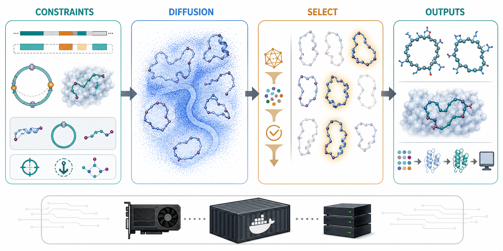

RFpeptide/RFdiffusion is the generative branch for constrained peptides,
especially macrocycles or designs with contig and topology requirements. Its
method focus is diffusion-based backbone sampling: generate many possible
shapes under user-defined constraints, then keep the ones that satisfy geometry,
diversity, and target-context requirements. These backbones usually need a
second step, such as MPNN sequence design, followed by AF2/AF3 validation and
Rosetta refinement.

RFpeptide/RFdiffusion 是约束多肽，尤其是大环肽或带 contig/拓扑要求设计的生成分支。
它的方法论重点是基于扩散模型的骨架采样：在用户给定约束下产生许多可能形状，再筛选
几何合理、多样性好、满足靶点上下文的骨架。这些骨架通常还需要第二步序列设计，
例如接 MPNN，然后再进入 AF2/AF3 验证和 Rosetta 优化。

See [docs/service-flows.md](docs/service-flows.md) for per-service build,
mount, and output diagrams.

每个服务的构建输入、运行时挂载和输出位置见
[docs/service-flows.md](docs/service-flows.md)。

For the local AlphaFold 3 image, model file layout, and run commands, see
[docs/af3-local-workflow.md](docs/af3-local-workflow.md).

本地 AlphaFold 3 镜像、权重文件位置和运行命令见
[docs/af3-local-workflow.md](docs/af3-local-workflow.md)。

For Docker image packaging, local archives, and restore commands, see
[docs/docker-packaging.md](docs/docker-packaging.md).

Docker 镜像封装、归档和恢复命令见
[docs/docker-packaging.md](docs/docker-packaging.md)。

Use `./scripts/fetch-af3-databases.sh start` to prepare AF3 databases with the
official fetch script and project paths.

可用 `./scripts/fetch-af3-databases.sh start` 按项目路径调用官方脚本准备 AF3
数据库。

For a beginner-friendly Chinese guide covering Linux basics, shell scripts,
command parameters, and peptide design workflows, see
[docs/undergrad-guide-zh.md](docs/undergrad-guide-zh.md).

面向药学本科生的中文入门手册见
[docs/undergrad-guide-zh.md](docs/undergrad-guide-zh.md)，其中包含 Linux 基础、
`.sh` 脚本读法、命令参数和多肽生成/改造流程说明。

Runnable task-level examples are available under [examples/](examples/).

可运行的任务级示例位于 [examples/](examples/)。

## Docker Flow / Docker 流程

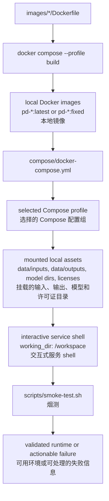

## Compose Profiles / Compose 配置组

| Profile / 配置组 | Service / 服务 | Purpose / 用途 | GPU |
| --- | --- | --- | --- |
| `foundry`, `design`, `rfd3`, `mpnn` | `pd-foundry-gpu` | Foundry/RFD3/MPNN workflows / Foundry、RFD3、MPNN 流程 | yes / 是 |
| `bindcraft` | `pd-bindcraft-gpu` | BindCraft binder design / BindCraft 结合蛋白设计 | yes / 是 |
| `af2`, `multimer` | `pd-af2multimer-gpu` | AlphaFold Multimer validation / AlphaFold Multimer 验证 | yes / 是 |
| `af3`, `validate` | `pd-af3-gpu` | AlphaFold 3 validation / AlphaFold 3 验证 | yes / 是 |
| `rosetta`, `post`, `rosetta-parallel` | `pd-rosetta-cpu-parallel` | Rosetta relax/scoring/post-processing / Rosetta 优化、评分、后处理 | no / 否 |
| `pepmimic` | `pd-pepmimic-gpu` | PepMimic workflows / PepMimic 流程 | yes / 是 |
| `rfpeptide`, `macrocycle` | `pd-rfpeptide-gpu` | RFpeptide/RFdiffusion macrocycle workflows / RFpeptide 与 RFdiffusion 大环流程 | yes / 是 |

## Runtime Mounts / 运行时挂载

All Compose services mount `data/inputs`, `data/outputs`, and `scripts` into the
container. The tracked `examples` directory is mounted read-only at
`/workspace/examples`.

所有 Compose 服务都会把 `data/inputs`、`data/outputs` 和 `scripts` 挂载到容器中。
已跟踪的 `examples` 目录会以只读方式挂载到 `/workspace/examples`。

Service-specific mounts / 服务专属挂载:

| Service / 服务 | Mounted assets / 挂载资源 |
| --- | --- |
| `pd-foundry-gpu` | `data/foundry_checkpoints` |
| `pd-bindcraft-gpu` | `data/bindcraft_models`, `data/licenses` |
| `pd-af2multimer-gpu` | `data/alphafold_db` |
| `pd-af3-gpu` | `data/alphafold3/models`, `data/alphafold3/public_databases`, `data/alphafold3/jax_cache` |
| `pd-rosetta-cpu-parallel` | `data/rosetta_db`, `data/licenses` |
| `pd-pepmimic-gpu` | `data/pepmimic_checkpoints`, `data/licenses` |
| `pd-rfpeptide-gpu` | `data/rfpeptide_models` |

## Common Commands / 常用命令

Validate Compose configuration / 验证 Compose 配置:

```bash
docker compose -f compose/docker-compose.yml config --quiet
```

Check host GPU / 检查宿主机 GPU:

```bash
nvidia-smi
```

Build or refresh a service image / 构建或刷新服务镜像:

```bash
docker compose -f compose/docker-compose.yml --profile foundry build pd-foundry-gpu
docker compose -f compose/docker-compose.yml --profile af2 build pd-af2multimer-gpu
docker build -t pd-af3-gpu:v3.0.2 -f data/src/alphafold3/docker/Dockerfile data/src/alphafold3
docker compose -f compose/docker-compose.yml --profile rosetta build pd-rosetta-cpu-parallel
docker compose -f compose/docker-compose.yml --profile pepmimic build pd-pepmimic-gpu
docker compose -f compose/docker-compose.yml --profile rfpeptide build pd-rfpeptide-gpu
```

Open a service shell / 打开服务 shell:

```bash
docker compose -f compose/docker-compose.yml --profile foundry run --rm pd-foundry-gpu
docker compose -f compose/docker-compose.yml --profile bindcraft run --rm pd-bindcraft-gpu
docker compose -f compose/docker-compose.yml --profile af2 run --rm pd-af2multimer-gpu
docker compose -f compose/docker-compose.yml --profile af3 run --rm pd-af3-gpu
docker compose -f compose/docker-compose.yml --profile rosetta run --rm pd-rosetta-cpu-parallel
docker compose -f compose/docker-compose.yml --profile pepmimic run --rm pd-pepmimic-gpu
docker compose -f compose/docker-compose.yml --profile rfpeptide run --rm pd-rfpeptide-gpu
```

Run smoke checks / 运行烟测:

```bash
./scripts/smoke-test.sh all
```

Export or restore the current AF3 image archive / 导出或恢复当前 AF3 镜像归档:

```bash
docker save -o releases/pd-af3-gpu_v3.0.2_20260529.tar pd-af3-gpu:v3.0.2
docker load -i releases/pd-af3-gpu_v3.0.2_20260529.tar
```

Run workflow examples / 运行工作流示例:

```bash
./examples/foundry/run-mpnn-pdl1.sh
./examples/af2multimer/run-check-or-full.sh
./examples/af3/run-check-or-full.sh
./examples/rosetta/run-relax-pdl1.sh
./examples/confidence/run-merge-srcr.sh
```

Merge confidence JSON files into ranked CSV/XLSX tables /
合并置信度 JSON 并输出排序后的 CSV/XLSX 表:

```bash
python3 scripts/merge_confidence_tables.py \
  --root-dir data/outputs/AAAWZY/srcr-rf3
```

Write CSV only to an explicit path / 只写 CSV 到指定路径:

```bash
python3 scripts/merge_confidence_tables.py \
  --root-dir data/outputs/AAAWZY/srcr-rf3 \
  --out-csv /tmp/srcr-rf3-confidence.csv \
  --no-xlsx
```

## Operational Notes / 运维注意事项

- Use Compose for Rosetta so that `data/rosetta_db` is mounted at
  `/opt/rosetta_db`. / Rosetta 请通过 Compose 运行，确保 `data/rosetta_db`
  挂载到 `/opt/rosetta_db`。
- Use `pd-rfpeptide-gpu:fixed` for RFpeptide. The local `latest` tag is not the
  known-good runtime. / RFpeptide 使用 `pd-rfpeptide-gpu:fixed`，本地 `latest`
  不是已确认可用的运行环境。
- AlphaFold 3 uses the independent `pd-af3-gpu:v3.0.2` image. It does not use
  the AlphaFold 2 Multimer image or `data/alphafold_db`. / AlphaFold 3 使用独立
  的 `pd-af3-gpu:v3.0.2` 镜像，不使用 AlphaFold 2 Multimer 镜像或
  `data/alphafold_db`。
- The AlphaFold 3 model file lives at `data/alphafold3/models/af3.bin.zst` and
  is mounted into the container at `/root/models/af3.bin.zst`. / AlphaFold 3
  权重文件位于 `data/alphafold3/models/af3.bin.zst`，容器内路径为
  `/root/models/af3.bin.zst`。
- The AlphaFold 3 public databases are complete locally and stay outside the
  image under `data/alphafold3/public_databases/`. / AlphaFold 3 公共数据库已在
  本机完成准备，保留在镜像外的 `data/alphafold3/public_databases/` 下。
- Do not commit local model files or workflow outputs. Check `git status`
  before every commit. / 不要提交本地模型文件或工作流输出；每次提交前检查
  `git status`。
- Docker build cache is large on this machine. Do not prune it until critical
  images are exported or confirmed rebuildable. / 这台机器上的 Docker 构建缓存较大；
  关键镜像导出或确认可重建前不要清理。
