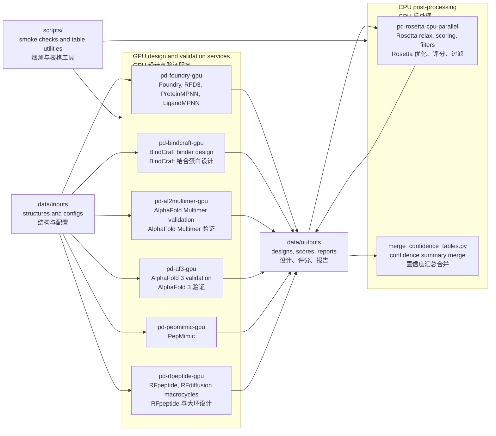
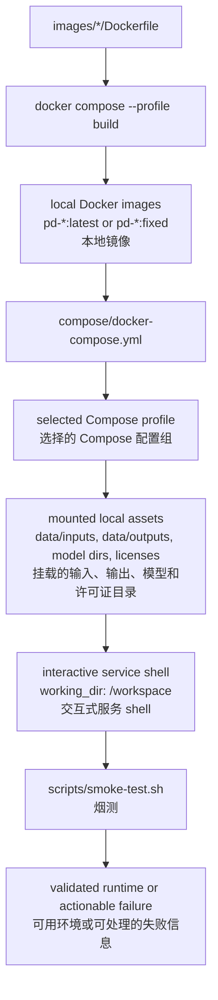

# Protein Design Workbench

<p align="center">
  
</p>

Docker-based local workbench for protein design workflows on this machine.

本仓库是这台机器上的蛋白设计本地工作台，主要用 Docker Compose 管理
Foundry/RFD3、BindCraft、AlphaFold Multimer、AlphaFold 3、Rosetta、PepMimic
和 RFpeptide 等运行环境。

Current version / 当前版本: `v0.2.0`

Release notes / 版本说明: [CHANGELOG.md](CHANGELOG.md)

This repository tracks only lightweight engineering assets. Large local assets
stay outside Git under `data/` and `releases/`.

本仓库只跟踪轻量工程文件。模型权重、数据库、设计输出和镜像归档等大文件保留在
`data/` 和 `releases/` 下，不进入 Git。

## Repository Policy / 仓库策略

Tracked in Git / Git 跟踪内容:

- `compose/`: Docker Compose service definitions / Docker Compose 服务定义
- `images/*/Dockerfile`: Docker build recipes / Docker 镜像构建文件
- `scripts/`: utility scripts / 工具脚本
- `docs/`, `README.md`, `.gitignore`, and other small configuration files /
  文档、README、忽略规则和其他小型配置文件

Not tracked in Git / Git 不跟踪内容:

- model weights and checkpoints / 模型权重和检查点
- Rosetta source/database assets / Rosetta 源码和数据库资源
- AlphaFold, BindCraft, Foundry, PepMimic, and RFdiffusion parameters /
  AlphaFold、BindCraft、Foundry、PepMimic 和 RFdiffusion 参数
- generated outputs and score tables / 生成结果和评分表
- Docker image archives and release bundles / Docker 镜像归档和发布包
- local crash logs, PDFs, shell history, and editor caches /
  本地崩溃日志、PDF、shell 历史和编辑器缓存

## Local Asset Layout / 本地资产目录

| Path / 路径 | Purpose / 用途 |
| --- | --- |
| `data/inputs/` | input structures and workflow configuration / 输入结构和流程配置 |
| `data/outputs/` | generated workflow outputs / 生成的设计结果 |
| `data/alphafold_db/` | AlphaFold 2 Multimer parameter/database assets / AlphaFold 2 Multimer 参数和数据库 |
| `data/alphafold3/models/` | AlphaFold 3 model file, including `af3.bin.zst` / AlphaFold 3 权重文件 |
| `data/alphafold3/public_databases/` | AlphaFold 3 sequence/template databases / AlphaFold 3 序列和模板数据库 |
| `data/alphafold3/jax_cache/` | AlphaFold 3 JAX compilation cache / AlphaFold 3 JAX 编译缓存 |
| `data/bindcraft_models/` | BindCraft model parameters / BindCraft 模型参数 |
| `data/foundry_checkpoints/` | Foundry/ProteinMPNN/LigandMPNN checkpoints / Foundry、ProteinMPNN、LigandMPNN 检查点 |
| `data/pepmimic_checkpoints/` | PepMimic checkpoints / PepMimic 检查点 |
| `data/rfpeptide_models/` | RFpeptide/RFdiffusion checkpoints / RFpeptide、RFdiffusion 检查点 |
| `data/rosetta_db` | symlink to the local Rosetta database / 指向本地 Rosetta 数据库的软链接 |
| `releases/` | exported local image bundles / 导出的本地镜像包 |

## Workflow Overview / 工作流概览



The graphical abstract below was generated with `imagegen` in a
Nature Methods-style academic visual language. It integrates the repository
workflow overview, method-level information flow, and per-image workflow
figures into one reader-facing map. Exact tool names, paths, and information
transfer rules are documented in the captions, tables, and remaining
operational Mermaid diagrams that follow.

下图使用 `imagegen` 生成，采用接近 Nature Methods 图形摘要的学术视觉风格。它把
项目总览、方法层信息流和各镜像流程整合成一张便于阅读的流程图。准确的工具名称、
路径和信息传递关系以随后可维护的图注、表格和运维 Mermaid 图为准。


Figure guide / 图示说明:

- `INPUTS`: structures, sequences, AF3 JSON, FASTA, settings, and database
  evidence. / 输入结构、序列、AF3 JSON、FASTA、配置和数据库证据。
- `DESIGN`: generation and redesign modules such as Foundry/RFD3/MPNN,
  BindCraft, PepMimic, and RFpeptide. / 生成与改造模块，包括
  Foundry/RFD3/MPNN、BindCraft、PepMimic 和 RFpeptide。
- `VALIDATE`: AF2 Multimer and AF3 complex inference with confidence metrics.
  / AF2 Multimer 与 AF3 复合物推断和置信度指标。
- `REFINE`: Rosetta physical relaxation and scoring. / Rosetta 物理优化与打分。
- `RANK`: ranked candidate structures, sequences, confidence tables, and
  decision-ready portfolios. / 排序后的候选结构、序列、置信度表和可决策候选集合。

## Method-Level Information Flow / 方法学信息流

The workbench is organized as a modular computational pipeline. Each Docker
image preserves a distinct methodological role, while `data/inputs` and
`data/outputs` act as explicit boundaries for exchanging structures, sequences,
configuration files, confidence metrics, and ranked candidate tables.

本项目按模块化计算流程组织。每个 Docker 镜像承担相对独立的方法学角色；
`data/inputs` 和 `data/outputs` 是结构、序列、配置、置信度指标和候选排序表之间
传递信息的边界。

### Overall Project Flow / 整体项目流程


This figure summarizes the conceptual data path from research question to
candidate ranking. The key point is that structural hypotheses, sequence
variants, database evidence, and confidence metrics remain explicit objects
throughout the workflow rather than hidden intermediate state.

该图概括了从研究问题到候选排序的概念性信息路径。重点是：结构假设、序列变体、
数据库证据和置信度指标在整个流程中都以显式对象传递，而不是隐藏在中间状态中。

### Tool Roles and Transferred Information / 工具角色与传递信息

| Docker image / 镜像 | Methodological role / 方法学角色 | Input information emphasis / 输入信息侧重 | Transformation focus / 转换重点 | Output information passed downstream / 下游传递信息 |
| --- | --- | --- | --- | --- |
| `pd-foundry-gpu` | Foundry/RFD3/ProteinMPNN/LigandMPNN design environment / 生成式设计与序列设计环境 | Target structures, contigs, chain topology, fixed residues, design constraints / 靶点结构、contig、链拓扑、固定残基、设计约束 | Backbone generation and sequence compatibility under geometric constraints / 在几何约束下生成骨架并匹配序列 | Candidate backbones, designed sequences, design metadata / 候选骨架、设计序列、设计元数据 |
| `pd-bindcraft-gpu` | Binder and peptide-binder optimization / 结合蛋白或结合肽优化 | Target PDB, hotspot residues, chain definitions, run settings / 靶点 PDB、热点残基、链定义、运行配置 | Interface-aware sequence-structure co-optimization / 面向界面的序列-结构协同优化 | Binder structures, trajectories, sequence sets, interface scores / 结合体结构、轨迹、序列集合、界面评分 |
| `pd-af2multimer-gpu` | AlphaFold 2 Multimer complex validation / AF2 Multimer 复合物验证 | FASTA chains, MSA/template database evidence, multimer preset / 多链 FASTA、MSA/模板数据库证据、multimer 配置 | Complex structure inference and interface confidence estimation / 复合物结构推断与界面可信度估计 | Ranked models, pLDDT, pTM, ipTM, PAE, interface diagnostics / 排序模型、pLDDT、pTM、ipTM、PAE、界面诊断 |
| `pd-af3-gpu` | AlphaFold 3 validation for protein, peptide, and broader molecular inputs / AF3 结构验证 | AF3 JSON, model parameters, public databases, template date / AF3 JSON、模型权重、公共数据库、模板日期 | Generalized structure inference with JAX compilation cache / 利用 JAX 缓存进行更通用的结构推断 | CIF structures, ranking outputs, confidence JSON, run settings / CIF 结构、排序结果、置信度 JSON、运行参数 |
| `pd-rosetta-cpu-parallel` | Rosetta physical refinement and scoring / Rosetta 物理优化与打分 | Candidate PDB/CIF, Rosetta database, optional constraints / 候选 PDB/CIF、Rosetta 数据库、可选约束 | Local relaxation, steric correction, energy and interface scoring / 局部 relax、空间冲突修正、能量与界面评分 | Relaxed structures, score files, filtered candidates / 优化结构、打分文件、过滤后的候选 |
| `pd-pepmimic-gpu` | PepMimic motif and epitope mimicry workflow / PepMimic 模体和表位模拟 | Epitope geometry, reference motif, checkpoint assets / 表位几何、参考模体、checkpoint | Learning-based peptide mimic generation / 基于模型的多肽模拟生成 | Mimetic peptide candidates, structural hypotheses, scores / 模拟肽候选、结构假设、评分 |
| `pd-rfpeptide-gpu` | RFpeptide/RFdiffusion macrocycle and constrained peptide generation / RFpeptide/RFdiffusion 大环与约束多肽生成 | Contig constraints, macrocycle settings, model checkpoints / contig 约束、大环设置、模型权重 | Diffusion-based constrained backbone generation / 基于扩散模型的约束骨架生成 | Cyclic or constrained peptide backbones, candidate designs / 环肽或约束多肽骨架、候选设计 |

### Per-Image Workflow Figures / 各镜像流程图

#### `pd-foundry-gpu`


Input emphasis: target structures, contig definitions, motif/interface rules,
and fixed residues. The image highlights backbone generation followed by
MPNN-style sequence redesign, producing candidate structures and designed
sequences for validation.

输入侧重靶点结构、contig 定义、模体/界面规则和固定残基。图中强调先生成骨架，
再进行 MPNN 风格的序列改造，输出候选结构和设计序列用于后续验证。

#### `pd-bindcraft-gpu`


Input emphasis: receptor structure, hotspot residues, chain definitions,
binder length, and filtering settings. The image focuses on iterative
interface-aware design, where structural trajectories and interface scores
select candidate binders for validation.

输入侧重受体结构、热点残基、链定义、binder 长度和过滤设置。图中突出面向界面的
迭代设计过程，通过结构轨迹和界面评分筛选候选结合体。

#### `pd-af2multimer-gpu`


Input emphasis: multi-chain FASTA plus MSA/template database evidence. The
image highlights complex inference and confidence outputs, especially pLDDT,
pTM, ipTM, and PAE-like matrices used for interface triage.

输入侧重多链 FASTA 以及 MSA/模板数据库证据。图中突出复合物推断和置信度输出，
尤其是用于界面筛选的 pLDDT、pTM、ipTM 和 PAE 类矩阵。

#### `pd-af3-gpu`


Input emphasis: AF3 JSON molecule specifications, `af3.bin.zst`, public
databases, template date, and JAX compilation cache. The image separates AF3
from AF2 Multimer by showing JSON-native inputs and model/database mounts.

输入侧重 AF3 JSON 分子定义、`af3.bin.zst`、公共数据库、模板日期和 JAX 编译缓存。
图中特意把 AF3 与 AF2 Multimer 区分开，强调 JSON 输入以及模型/数据库挂载。

#### `pd-rosetta-cpu-parallel`


Input emphasis: candidate PDB/CIF structures and the Rosetta database. The
image highlights local physical refinement, steric correction, scoring, and
filtering before final candidate triage.

输入侧重候选 PDB/CIF 结构和 Rosetta 数据库。图中突出局部物理优化、空间冲突修正、
打分和过滤，然后进入最终候选筛选。

#### `pd-pepmimic-gpu`


Input emphasis: epitope geometry, reference motifs, and PepMimic checkpoints.
The image focuses on motif-preserving mimetic peptide generation and structural
plausibility screening before AF2/AF3 validation.

输入侧重表位几何、参考模体和 PepMimic checkpoint。图中强调保留模体几何的模拟肽
生成，以及进入 AF2/AF3 前的结构合理性筛查。

#### `pd-rfpeptide-gpu`


Input emphasis: contig constraints, macrocycle topology, target context, and
checkpoint assets. The image highlights diffusion-based constrained backbone
sampling and selection by geometry, diversity, and constraint satisfaction.

输入侧重 contig 约束、大环拓扑、靶点上下文和模型权重。图中突出基于扩散模型的
约束骨架采样，并按几何合理性、多样性和约束满足程度筛选。

See [docs/service-flows.md](docs/service-flows.md) for per-service build,
mount, and output diagrams.

每个服务的构建输入、运行时挂载和输出位置见
[docs/service-flows.md](docs/service-flows.md)。

For the local AlphaFold 3 image, model file layout, and run commands, see
[docs/af3-local-workflow.md](docs/af3-local-workflow.md).

本地 AlphaFold 3 镜像、权重文件位置和运行命令见
[docs/af3-local-workflow.md](docs/af3-local-workflow.md)。

Use `./scripts/fetch-af3-databases.sh start` to prepare AF3 databases with the
official fetch script and project paths.

可用 `./scripts/fetch-af3-databases.sh start` 按项目路径调用官方脚本准备 AF3
数据库。

For a beginner-friendly Chinese guide covering Linux basics, shell scripts,
command parameters, and peptide design workflows, see
[docs/undergrad-guide-zh.md](docs/undergrad-guide-zh.md).

面向药学本科生的中文入门手册见
[docs/undergrad-guide-zh.md](docs/undergrad-guide-zh.md)，其中包含 Linux 基础、
`.sh` 脚本读法、命令参数和多肽生成/改造流程说明。

Runnable task-level examples are available under [examples/](examples/).

可运行的任务级示例位于 [examples/](examples/)。

## Docker Flow / Docker 流程



## Compose Profiles / Compose 配置组

| Profile / 配置组 | Service / 服务 | Purpose / 用途 | GPU |
| --- | --- | --- | --- |
| `foundry`, `design`, `rfd3`, `mpnn` | `pd-foundry-gpu` | Foundry/RFD3/MPNN workflows / Foundry、RFD3、MPNN 流程 | yes / 是 |
| `bindcraft` | `pd-bindcraft-gpu` | BindCraft binder design / BindCraft 结合蛋白设计 | yes / 是 |
| `af2`, `multimer` | `pd-af2multimer-gpu` | AlphaFold Multimer validation / AlphaFold Multimer 验证 | yes / 是 |
| `af3`, `validate` | `pd-af3-gpu` | AlphaFold 3 validation / AlphaFold 3 验证 | yes / 是 |
| `rosetta`, `post`, `rosetta-parallel` | `pd-rosetta-cpu-parallel` | Rosetta relax/scoring/post-processing / Rosetta 优化、评分、后处理 | no / 否 |
| `pepmimic` | `pd-pepmimic-gpu` | PepMimic workflows / PepMimic 流程 | yes / 是 |
| `rfpeptide`, `macrocycle` | `pd-rfpeptide-gpu` | RFpeptide/RFdiffusion macrocycle workflows / RFpeptide 与 RFdiffusion 大环流程 | yes / 是 |

## Runtime Mounts / 运行时挂载

All Compose services mount `data/inputs`, `data/outputs`, and `scripts` into the
container. The tracked `examples` directory is mounted read-only at
`/workspace/examples`.

所有 Compose 服务都会把 `data/inputs`、`data/outputs` 和 `scripts` 挂载到容器中。
已跟踪的 `examples` 目录会以只读方式挂载到 `/workspace/examples`。

Service-specific mounts / 服务专属挂载:

| Service / 服务 | Mounted assets / 挂载资源 |
| --- | --- |
| `pd-foundry-gpu` | `data/foundry_checkpoints` |
| `pd-bindcraft-gpu` | `data/bindcraft_models`, `data/licenses` |
| `pd-af2multimer-gpu` | `data/alphafold_db` |
| `pd-af3-gpu` | `data/alphafold3/models`, `data/alphafold3/public_databases`, `data/alphafold3/jax_cache` |
| `pd-rosetta-cpu-parallel` | `data/rosetta_db`, `data/licenses` |
| `pd-pepmimic-gpu` | `data/pepmimic_checkpoints`, `data/licenses` |
| `pd-rfpeptide-gpu` | `data/rfpeptide_models` |

## Common Commands / 常用命令

Validate Compose configuration / 验证 Compose 配置:

```bash
docker compose -f compose/docker-compose.yml config --quiet
```

Check host GPU / 检查宿主机 GPU:

```bash
nvidia-smi
```

Build or refresh a service image / 构建或刷新服务镜像:

```bash
docker compose -f compose/docker-compose.yml --profile foundry build pd-foundry-gpu
docker compose -f compose/docker-compose.yml --profile af2 build pd-af2multimer-gpu
docker build -t pd-af3-gpu:v3.0.2 -f data/src/alphafold3/docker/Dockerfile data/src/alphafold3
docker compose -f compose/docker-compose.yml --profile rosetta build pd-rosetta-cpu-parallel
docker compose -f compose/docker-compose.yml --profile pepmimic build pd-pepmimic-gpu
docker compose -f compose/docker-compose.yml --profile rfpeptide build pd-rfpeptide-gpu
```

Open a service shell / 打开服务 shell:

```bash
docker compose -f compose/docker-compose.yml --profile foundry run --rm pd-foundry-gpu
docker compose -f compose/docker-compose.yml --profile bindcraft run --rm pd-bindcraft-gpu
docker compose -f compose/docker-compose.yml --profile af2 run --rm pd-af2multimer-gpu
docker compose -f compose/docker-compose.yml --profile af3 run --rm pd-af3-gpu
docker compose -f compose/docker-compose.yml --profile rosetta run --rm pd-rosetta-cpu-parallel
docker compose -f compose/docker-compose.yml --profile pepmimic run --rm pd-pepmimic-gpu
docker compose -f compose/docker-compose.yml --profile rfpeptide run --rm pd-rfpeptide-gpu
```

Run smoke checks / 运行烟测:

```bash
./scripts/smoke-test.sh all
```

Run workflow examples / 运行工作流示例:

```bash
./examples/foundry/run-mpnn-pdl1.sh
./examples/af2multimer/run-check-or-full.sh
./examples/af3/run-check-or-full.sh
./examples/rosetta/run-relax-pdl1.sh
./examples/confidence/run-merge-srcr.sh
```

Merge confidence JSON files into ranked CSV/XLSX tables /
合并置信度 JSON 并输出排序后的 CSV/XLSX 表:

```bash
python3 scripts/merge_confidence_tables.py \
  --root-dir data/outputs/AAAWZY/srcr-rf3
```

Write CSV only to an explicit path / 只写 CSV 到指定路径:

```bash
python3 scripts/merge_confidence_tables.py \
  --root-dir data/outputs/AAAWZY/srcr-rf3 \
  --out-csv /tmp/srcr-rf3-confidence.csv \
  --no-xlsx
```

## Operational Notes / 运维注意事项

- Use Compose for Rosetta so that `data/rosetta_db` is mounted at
  `/opt/rosetta_db`. / Rosetta 请通过 Compose 运行，确保 `data/rosetta_db`
  挂载到 `/opt/rosetta_db`。
- Use `pd-rfpeptide-gpu:fixed` for RFpeptide. The local `latest` tag is not the
  known-good runtime. / RFpeptide 使用 `pd-rfpeptide-gpu:fixed`，本地 `latest`
  不是已确认可用的运行环境。
- AlphaFold 3 uses the independent `pd-af3-gpu:v3.0.2` image. It does not use
  the AlphaFold 2 Multimer image or `data/alphafold_db`. / AlphaFold 3 使用独立
  的 `pd-af3-gpu:v3.0.2` 镜像，不使用 AlphaFold 2 Multimer 镜像或
  `data/alphafold_db`。
- The AlphaFold 3 model file lives at `data/alphafold3/models/af3.bin.zst` and
  is mounted into the container at `/root/models/af3.bin.zst`. / AlphaFold 3
  权重文件位于 `data/alphafold3/models/af3.bin.zst`，容器内路径为
  `/root/models/af3.bin.zst`。
- Do not commit local model files or workflow outputs. Check `git status`
  before every commit. / 不要提交本地模型文件或工作流输出；每次提交前检查
  `git status`。
- Docker build cache is large on this machine. Do not prune it until critical
  images are exported or confirmed rebuildable. / 这台机器上的 Docker 构建缓存较大；
  关键镜像导出或确认可重建前不要清理。
