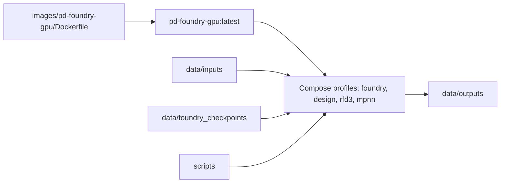
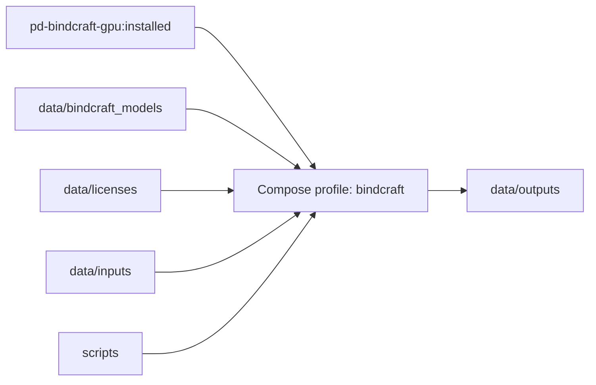
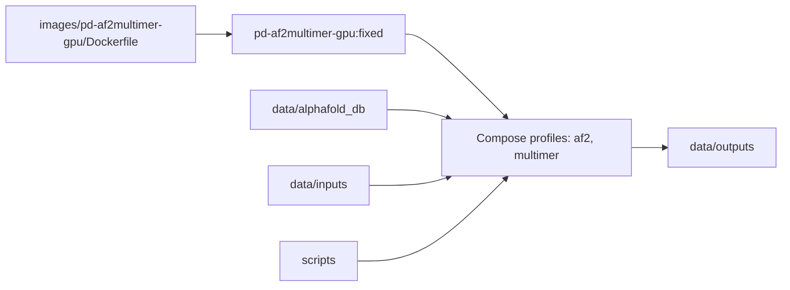
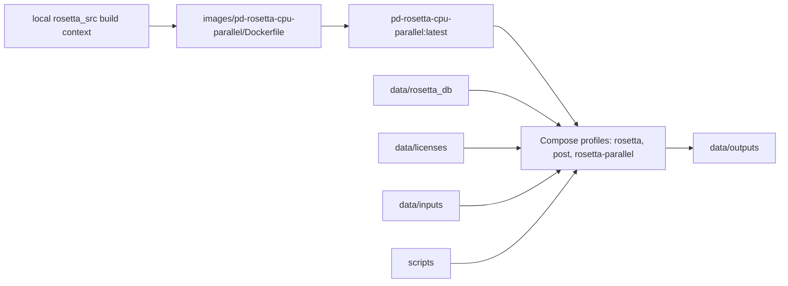
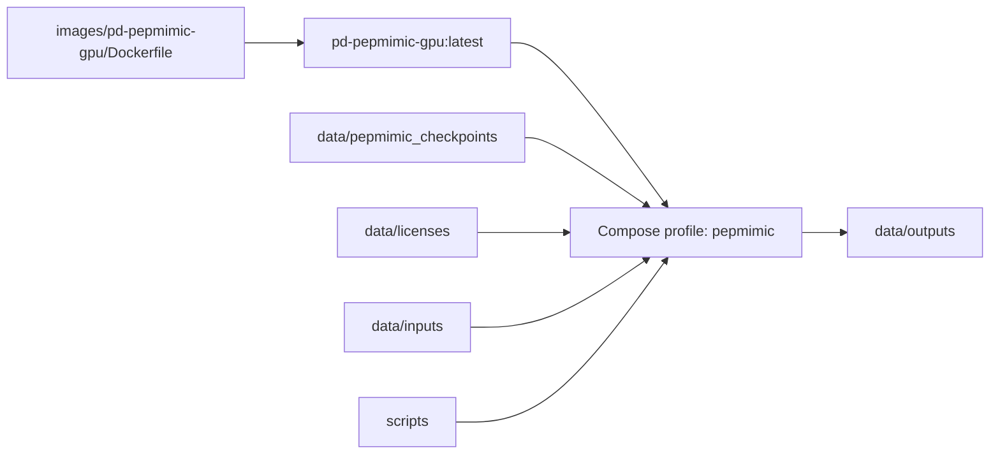
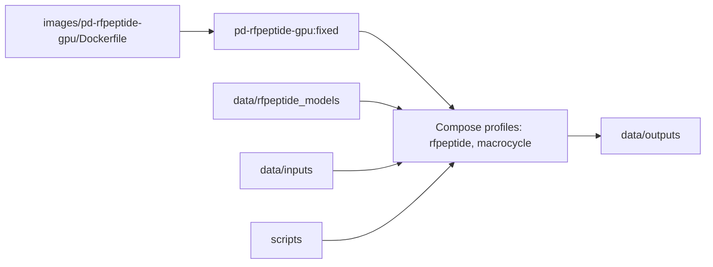
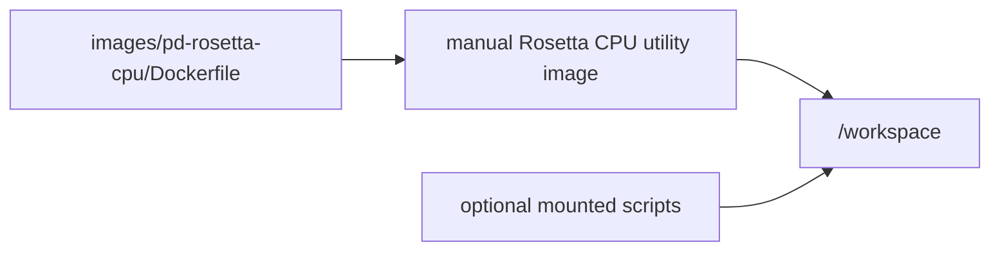

# Protein Design Service Flows

This document maps each local Docker image to its build inputs, mounted runtime
assets, and expected output locations. Large model, license, database, and
workflow output files stay under `data/` and are not tracked by Git.

## Foundry / RFD3 / MPNN

## BindCraft

## AlphaFold Multimer

## Rosetta CPU Parallel

## PepMimic

## RFpeptide / RFdiffusion Macrocycles

## Standalone Rosetta CPU Base

