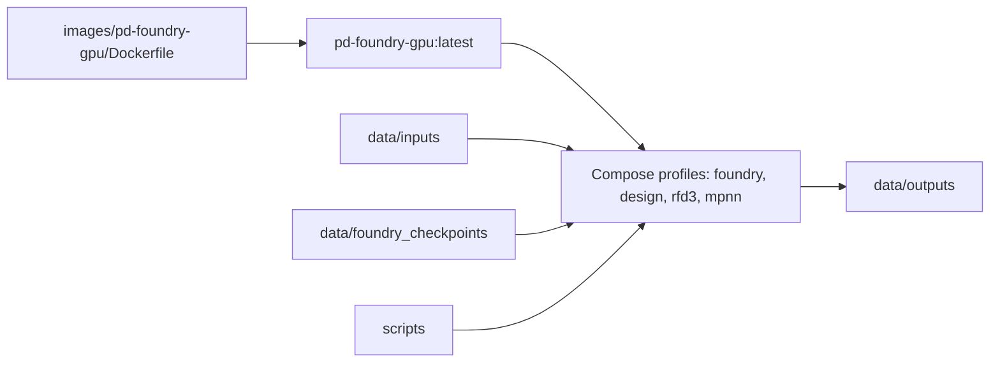
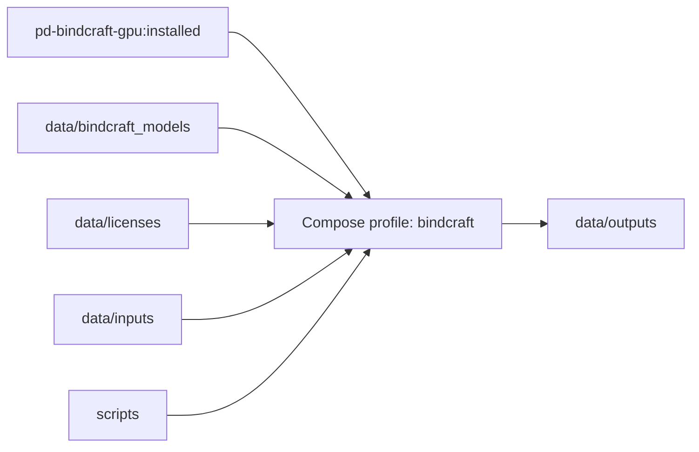
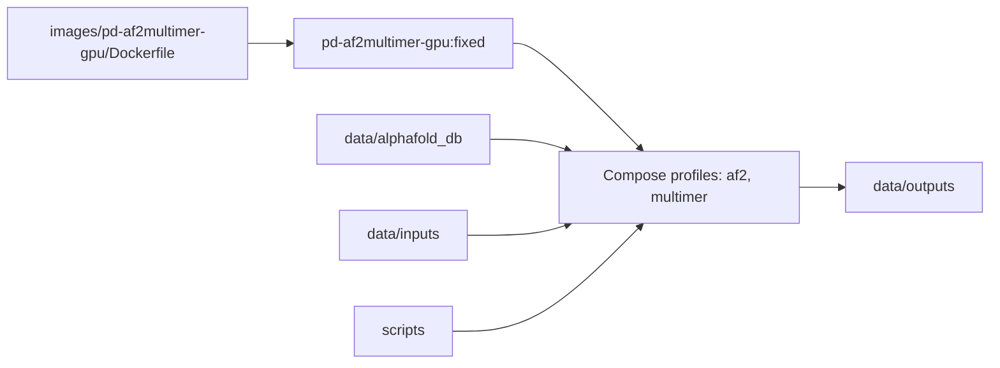
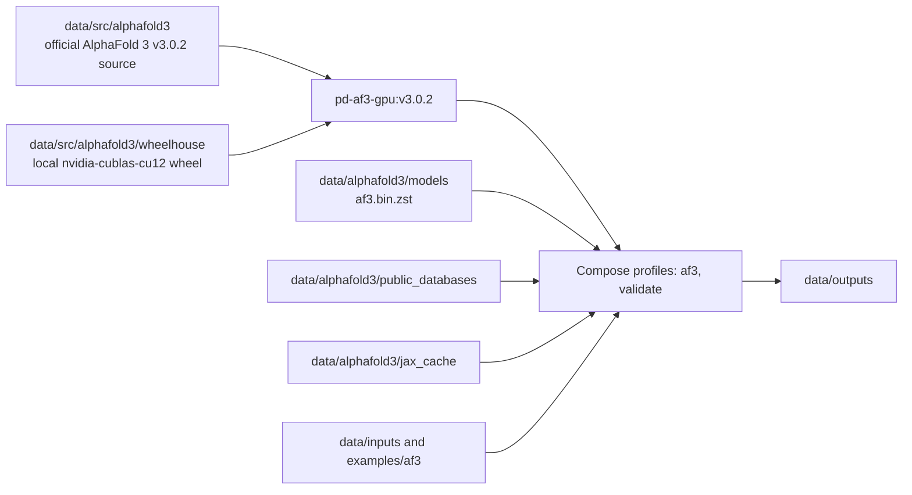
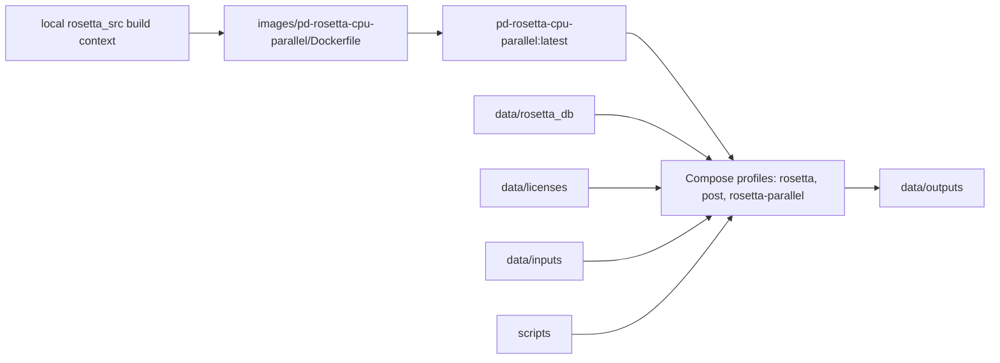
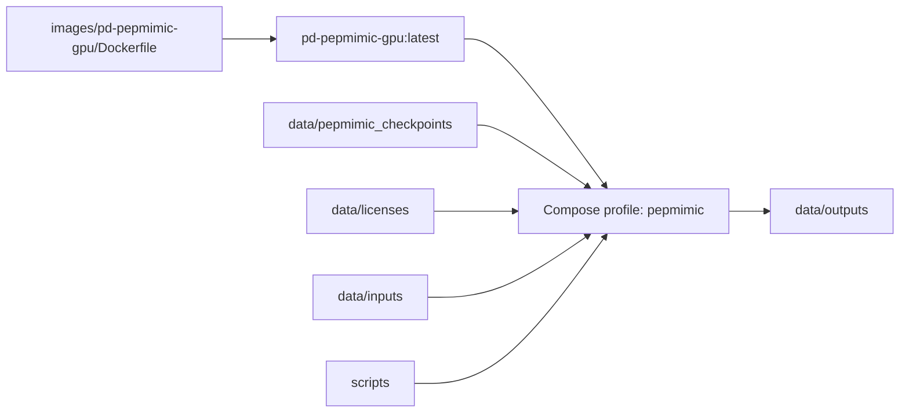
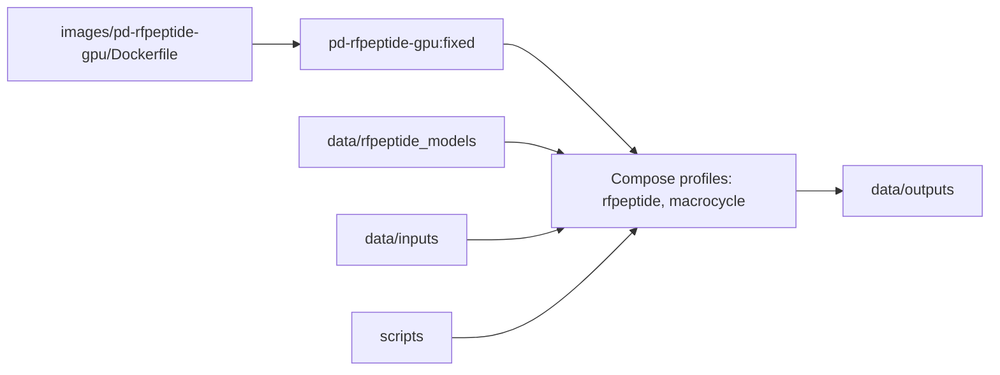
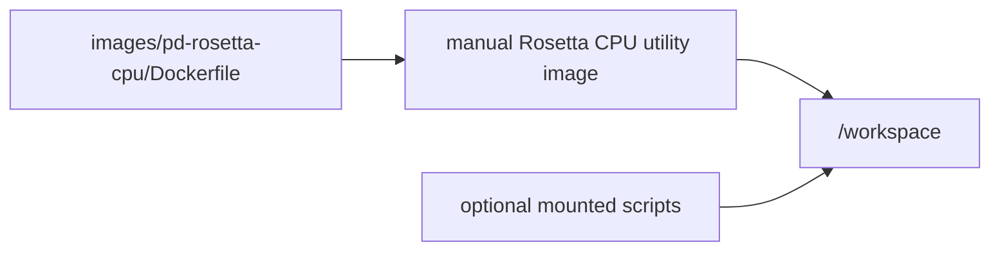

# Protein Design Service Flows

This document maps each local Docker image to its build inputs, mounted runtime
assets, and expected output locations. Large model, license, database, and
workflow output files stay under `data/` and are not tracked by Git.

For a reader-facing graphical summary, see the project-level visual abstract:

The figure compresses the same operational structure described below into five
information states: inputs, design, validation, refinement, and ranked outputs.
The Mermaid diagrams in this document remain the exact source of path-level
details for each image.

## Foundry / RFD3 / MPNN

## BindCraft

## AlphaFold Multimer

## AlphaFold 3

AlphaFold 3 is independent from AlphaFold 2 Multimer in this project. The
`pd-af3-gpu:v3.0.2` image is built from the official AlphaFold 3 source under
`data/src/alphafold3`; it does not use `pd-af2multimer-gpu`, the AlphaFold 2
Multimer Dockerfile, or `data/alphafold_db`.

本项目中 AlphaFold 3 与 AlphaFold 2 Multimer 相互独立。`pd-af3-gpu:v3.0.2`
镜像来自 `data/src/alphafold3` 下的官方 AlphaFold 3 源码，不使用
`pd-af2multimer-gpu`、AlphaFold 2 Multimer Dockerfile 或 `data/alphafold_db`。

## Rosetta CPU Parallel

## PepMimic

## RFpeptide / RFdiffusion Macrocycles

## Standalone Rosetta CPU Base

